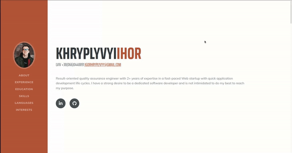
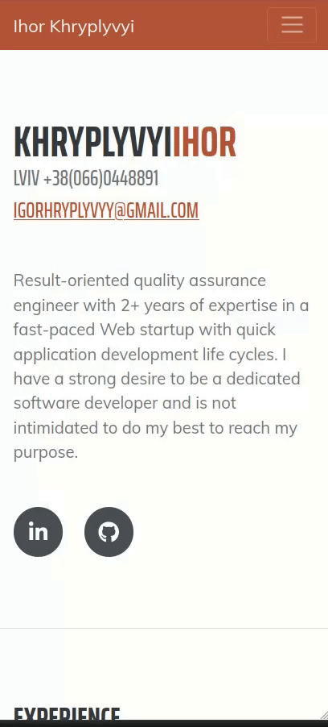

# Short description

## **cv-app-react** is a Bootstrap resume or CV landing page theme to help you beautifully create easy to use, stylish resume websites!

<br>

# Features

- ### A fixed side navigation with scrolling page anchors
- ### Resume sections to feature work experience, education, skills, and more!

# Easy start

## To start working with this app just type in your CLI

> ### This will create the **node_modules** directory in your current directory and will download the package to that directory.

<br>

```
npm install
```

## Bravo! The hardest part is back. To run the app type

```
npm start
```

# Demo

### :computer: Desktop view



<br>

### :iphone: Mobile view



## [Live link](https://resume-app-react.herokuapp.com/#skills)

<br>

# Credits

## Credits to Simon Defrenet for an idea and inspiration. The full version of his article you can find [here](https://www.linkedin.com/pulse/how-make-deploy-your-own-online-resume-using-reactjs-simon-defrenet/?trackingId=S3dpLM%2FKRNGgw0xH2KJBbQ%3D%3D).
